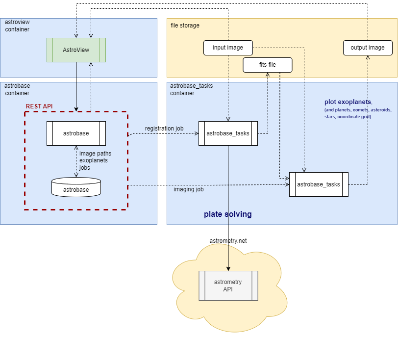
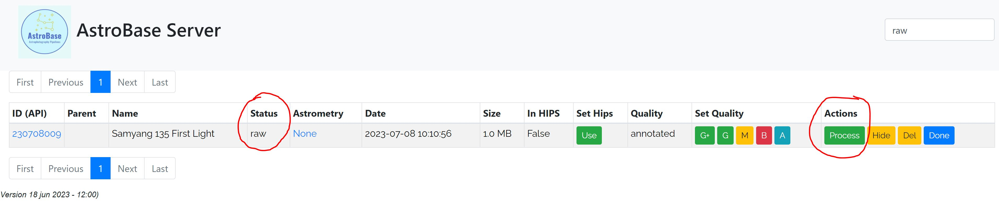

# astrobase_tasks

### astrobase
``astrobase_tasks`` is not a standalone package, but an addition to the ``astrobase`` project.
 ``Astrobase`` is a Django web application that wraps my observation database in a REST API, 
so that it can be accessed by a GUI (``AstroView``) and by the ``astrobase_tasks`` package. 

``Astrobase`` is also a (Django) backend that implements a number of data services, 
like importing external resources like comets, minor planets, exoplanets and stars.
And it is a controler for 'jobs' for plate solving and plotting additional information on the images.

### astrobase_tasks
This repo, ``astrobase_tasks``, is developed and deployed separately from ``astrobase`` 
and contains the underlying functionality for the 'jobs' mentioned above.
It runs various (async) tasks using Celery with RabbitMQ.

## The Technology Stack
  * Python 3.10
  * Celery
  * RabbitMQ

### Celery with RabbitMQ
There are 3 types of tasks that can be run simultaneously on 3 different Celery message queues
* registration jobs: 'plate solve' an image to nova.astronomy.net'and download the results (starchart, annotated image, fits files)
* imaging job: plot information on an image (grid, stars, transients, exoplanets)
* image cutout of a list of images

(inspired by : https://www.distributedpython.com/2018/11/15/celery-docker/)

### Docker
``astrobase_tasks`` runs in Docker together with some other services.
(The ``docker-compose.yml`` file is not provided in this repo)

* astrobase backend (REST API to the sqlite database) contains:
  * observations table (not needed for ``astrobase_tasks package``) 
  * jobs table, contains all information to run the task in ``astrobase_tasks``
  * exoplanets table, updated data about all the confirmed exoplanets

* rabbitMQ (message broker used by Celery)
* celery_beat (another instance of the ``astrobase_tasks`` image that provides the 'heartbeat' to check for new tasks)
  

## The Functionality

### registration_controller.py
The registration pipeline handles the ingest of new images into the observation database and the
plate solving at astrometry.net. It runs 4 microservices:

* ingest service: 
  * checks a 'landing_pad' directory on disk for the arrival of new images (jpg, png).
  * if a new image appears, it creates a 'specification' and pushes it to the ``astrobase`` REST API, where it will be stored in the database.
  * it moves the raw image to a storage disk (in my case a NAS in my local network) 
  * it removes the original file(s) from the landing_pad
  * the 'status' of the observation in the database is set to '**raw**'

(_this ingests a new observation in the astrobase database, which has its own GUI to start the 
plate solving process by clicking 'Process', after which the status goes to **pending**_)
  
* submit service:
  * checks the astrobase database (REST API) for observations with status '**pending**' 
  * when found, it sets the status to '**submitting**'
  * it submits the url of the original image to nova.astrometry.net
  * if that was succesful, it adds the astrometry.net job url to the observation metadata and sets the status over the observation to '**submitted**'
  
  * checks the astrobase database for observation with status **submitted**
  * when found, it checks the astrometry.net job status for 'succes'
  * when 'succes', it sets the status to '**processed**'
  
* process service:
  * checks the astrobase database (REST API) for observations with status '**processed**' 
  * if found, it downloads the results from astrometry.net
    * separate files are stored on the file system (NAS)
    * url's to those files are stored in the database
  * it sets the status to '**done**'
  
* cleanup service
  * checks the astrobase database (REST API) for observations with status '**removing**' (which can be set from the GUI)
  * it removes all the files for this observation from the file system (NAS)
  * it removes the observation from the database

### jobs_controller.py
Handles incoming jobs from ``astrobase``.

It polls the astrobase `jobs` API at an interval through the ``AstrobaseIO`` interface package.
The job contains all the information to complete the task.
Including the coordinates, shapes and colors of the objects to be plotten on an image.
(that information itself comes from the ``astrobase`` backend)

### fits_imaging.py
This module uses ``astropy`` and ``pillow`` to combine the WCS coordinatesystem in the fits file with plotting functionality on images.
There are a number of functions to plot various items:
* coordinate grid
* the stars and their magnitudes as used by astrometry.net for plate solving
* markers of different types and colors at coordinates, used for transients and exoplanets
* create image cutouts
